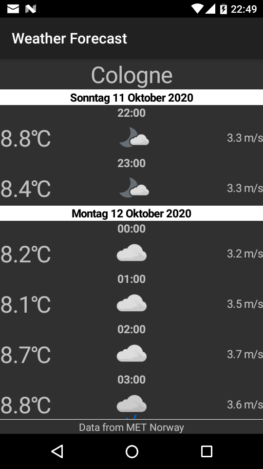

# Weather Forecast

This application displays weather forecasts from the yr.no service.
It is a Java port of the original Serpentine implementation, which 
is published under

https://gitlab.com/dboddie/weather-forecast

See the [Changelog](Changelog) for details about each version of this
application. **Note that version 1.2.0 and later may have issues with handling
secure communication with the server, particularly for older Android devices,
running versions earlier than Android 5 (Lollipop).**

### Adding, removing and selecting locations

The application is not configured to use any default locations, but a list of
preset locations are supplied. Select the text field at the bottom of the
screen, start entering a place name, and suggestions for the location will be
presented. You can optionally select one of the suggestions. Press the Add
button to add the location to the list. Since the list of known locations
is limited, your preferred location may not be available; see below for a
workaround for this problem.

To remove a location from the list, press and hold the relevant item in the
list until the Remove and Cancel buttons appear below the list. Press Remove to
remove the item or Cancel to keep it.

To view a forecast for a location, tap the relevant item. If a connection to
the yr.no server can be established, the location list will be hidden and the
forecast will be shown. Otherwise, a "No connection" message will be displayed.

### Adding custom locations

The app contains a list of known locations which I obtained from the yr.no
service, but yr.no itself knows about many more places than these. It was
previously possible to add custom locations to the list of those known by the
app, but this feature has been temporarily removed.

## Building the application

The development is done with Eclipse and andmore-Plugin. A direct gradle build is also supported.

### API Reference

Mininum SDK: 14
Target SDK: 29

## License

The source code of Weather Forecast is licensed under the GPLv3.

Copyright (C) 2017 David Boddie <david@boddie.org.uk>
Copyright (C) 2019 Dietmar Wippig <dwi336.dev@gmail.com>

This program is free software: you can redistribute it and/or modify
it under the terms of the GNU General Public License as published by
the Free Software Foundation, either version 3 of the License, or
(at your option) any later version.

This program is distributed in the hope that it will be useful,
but WITHOUT ANY WARRANTY; without even the implied warranty of
MERCHANTABILITY or FITNESS FOR A PARTICULAR PURPOSE.  See the
GNU General Public License for more details.

You should have received a copy of the GNU General Public License
along with this program.  If not, see <http://www.gnu.org/licenses/>.

The icons are licensed under The MIT License (MIT):

Copyright (c) 2015-2017 Yr

Permission is hereby granted, free of charge, to any person obtaining a copy
of this software and associated documentation files (the "Software"), to deal
in the Software without restriction, including without limitation the rights
to use, copy, modify, merge, publish, distribute, sublicense, and/or sell
copies of the Software, and to permit persons to whom the Software is
furnished to do so, subject to the following conditions:

The above copyright notice and this permission notice shall be included in all
copies or substantial portions of the Software.

THE SOFTWARE IS PROVIDED "AS IS", WITHOUT WARRANTY OF ANY KIND, EXPRESS OR
IMPLIED, INCLUDING BUT NOT LIMITED TO THE WARRANTIES OF MERCHANTABILITY,
FITNESS FOR A PARTICULAR PURPOSE AND NONINFRINGEMENT. IN NO EVENT SHALL THE
AUTHORS OR COPYRIGHT HOLDERS BE LIABLE FOR ANY CLAIM, DAMAGES OR OTHER
LIABILITY, WHETHER IN AN ACTION OF CONTRACT, TORT OR OTHERWISE, ARISING FROM,
OUT OF OR IN CONNECTION WITH THE SOFTWARE OR THE USE OR OTHER DEALINGS IN THE
SOFTWARE.

The place names included with the application are licensed under the terms of the Creative Commons
Attribution 4.0 International (CC BY 4.0) license [CC BY 4.0] (http://creativecommons.org/licenses/by/4.0/)
In addition to them the app uses icons from [Google Design Material Icons](https://design.google.com/icons/index.html) licensed under Apache License Version 2.0.

The weather forecasts are obtained from the service at met.no and the
application tries to follow the terms, conditions and guidelines for use of
that service:

https://www.met.no/en/free-meteorological-data/Licensing-and-crediting

The place names included with the application were obtained from the following
locations:

http://fil.nrk.no/yr/viktigestader/noreg.txt
http://fil.nrk.no/yr/viktigestader/verda.txt

This information is presumably provided under the terms of the Creative Commons
Attribution 4.0 International (CC BY 4.0) license, as used by the geonames.org
service for the data the noreg.txt and verda.txt files are based on.

The symbols supplied were obtained from the following repository and are
licensed under the MIT license:

https://api.met.no/weatherapi/weathericon/2.0/data

